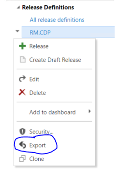

# Creating a copy of existing ReleaseManagement Definition 
## Overview
The extension will be used to 
1. **Clone**
2. **Export**
3. **Import**

## Details:
###Clone
Clone will appear as context menu to an existing release definition. With this one can create a copy of the current release definition with '-Copy' as suffix to the release definition name. On clicking save, it will create a new release definition with environment owner as current user.

###Export
Export will appear as context menu to an existing release definition. With this one can save release definition object as .json file. Which can later be used to import in same project/collection or different project/collection.

###Import
Import will appear as menu item near to '+' icon. With this one can create a release definition from a given .json file. Here agent queueId will be reset to '0' which means user have to give correct queueId before saving it.

