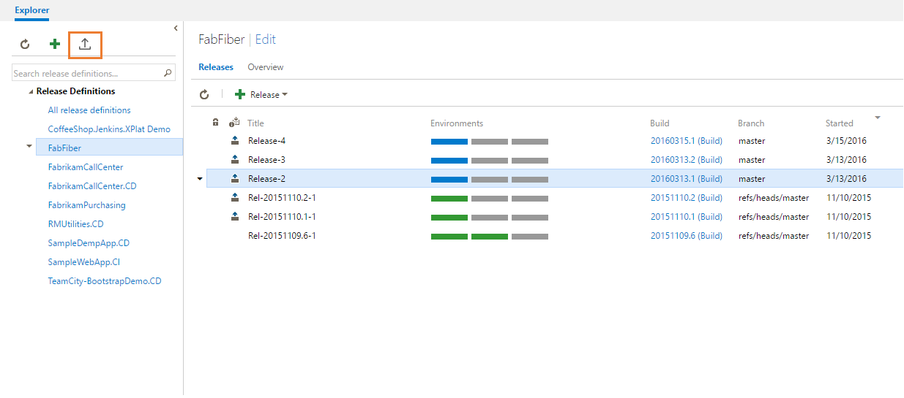

# Clone release definition
### Overview
This extension lets you copy your release definition in the same project or across projects/accounts. You may clone an existing RD to the same account+project or export it and import later in another project or another account+project.

### Details:
####Clone
Using this feature you can clone an existing Release definition (RD) in the same project.
__Clone__ option will appear as context menu to an existing release definition. On using this feature, a new RD gets created with the same name of the RD being cloned but appended by " - Copy".

####Export
This feature lets you export a Release definition. 
Export will appear as context menu to an existing release definition. With this one can save release definition object as .json file. This can later be used to import in same project/collection or different project/collection.

####Import
With this feature you can import an already existing exported json file of a Release Definition.
Import will appear as menu item near to '+' icon. With this one can create a release definition from a given .json file. Here agent queueId will be reset to '0' which means user have to give correct queueId before using it.

